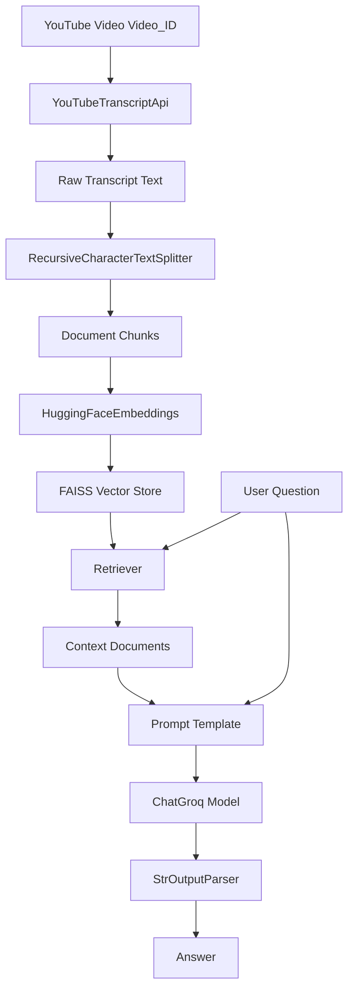

# Architecture

> Auto-generated by /map on 2026-04-13

## Overview

A Retrieval-Augmented Generation (RAG) chatbot that processes YouTube transcripts to answer user questions. It uses the YouTube Transcript API for data retrieval, LangChain for workflow orchestration, HuggingFace for embeddings, FAISS for vector storage, and Groq (LLM) for response generation.

## Components

### Data Retrieval (YouTube)
- **Purpose:** Fetches the transcript of a specific YouTube video.
- **Location:** `main.py` (lines 18, 23-27)
- **Dependencies:** `youtube_transcript_api`

### Processing & Embedding
- **Purpose:** Splits text into manageable chunks and converts them into vector embeddings.
- **Location:** `main.py` (lines 19-20, 41-45)
- **Dependencies:** `langchain_text_splitters`, `langchain_huggingface`

### Vector Store (FAISS)
- **Purpose:** Efficiently stores and retrieves document chunks based on semantic similarity.
- **Location:** `main.py` (lines 45-47)
- **Dependencies:** `langchain_community.vectorstores` (FAISS)

### LLM Orchestration (LangChain)
- **Purpose:** Chains together the retriever, prompt, and model into a single runnable unit.
- **Location:** `main.py` (lines 59-82)
- **Dependencies:** `langchain_core.runnables`, `langchain_groq`

## Data Flow

1. **Initialization:** The app loads environment variables and initializes the embedding model.
2. **Ingestion:** Fetches transcript for a predefined `video_id`, splits it into chunks, and populates the FAISS vector store.
3. **Query:** User enters a question via terminal.
4. **Retrieval:** The vector store retrieves the top 4 relevant chunks based on the question.
5. **Generation:** A prompt is constructed with the context and question, then sent to the Groq LLM.
6. **Output:** The LLM's response is parsed and printed to the terminal.

## Integration Points

| Service | Type | Purpose |
|---------|------|---------|
| YouTube | API | Transcript retrieval (requires no auth for public captions) |
| Groq | API | Large Language Model for chat completion |
| HuggingFace | Library/API | Local or remote embeddings (sentence-transformers) |

## Technical Debt

- [ ] **Hardcoded Video ID:** `video_id` is hardcoded in `main.py`.
- [ ] **Limited Error Handling:** Basic `try-except` for transcripts but lacks robust handling for API failures or empty contexts.
- [ ] **No Async Support:** Current implementation is synchronous, potentially blocking if scaled.
- [ ] **No Persistent DB:** FAISS is created in-memory on each run; no indexing persistence.
- [ ] **Model Selection:** Using `openai/gpt-oss-20b` via Groq; might need evaluation for optimal performance/cost.

## Conventions

**Naming:** Standard Python snake_case.
**Structure:** Flat structure with `main.py` as the primary script; `adapters/` and `docs/` for support files.
**Testing:** No automated tests found in the core codebase.
